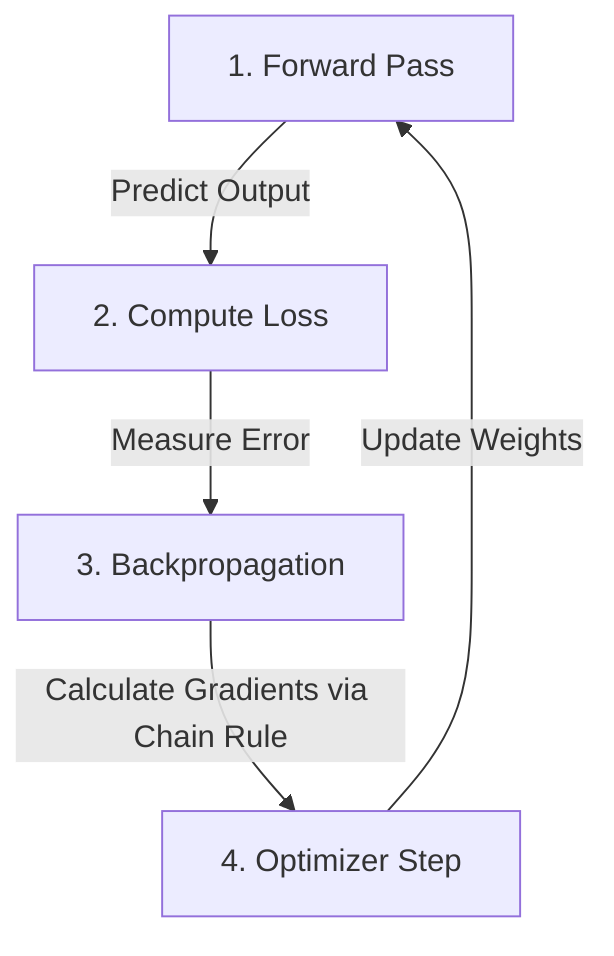

# 🧠 Applied Deep Learning & PyTorch: Beginner's Guide

Welcome to the **Applied Deep Learning & PyTorch Beginner's Guide**! This repository is designed to demystify neural networks, machine learning vs. deep learning, and PyTorch step-by-step. 

Whether you are completely new to artificial intelligence or looking for a structured, plain-English breakdown of core concepts, this guide and accompanying interactive Jupyter Notebook will give you a solid foundation.

---

## 📑 Table of Contents
1. [🤖 Machine Learning vs. Deep Learning](#-machine-learning-vs-deep-learning)
2. [🧩 Core Concepts Explained](#-core-concepts-explained)
   - [1. What is a Neuron?](#1-what-is-a-neuron)
   - [2. Why Non-Linearity Matters (The XOR Problem)](#2-why-non-linearity-matters-the-xor-problem)
   - [3. How a Network Learns (Forward Pass, Loss & Backpropagation)](#3-how-a-network-learns)
   - [4. Optimizers & Learning Rate](#4-optimizers--learning-rate)
   - [5. Overfitting & Early Stopping](#5-overfitting--early-stopping)
   - [6. Convolutional Neural Networks (CNNs) & Transfer Learning](#6-convolutional-neural-networks-cnns--transfer-learning)
3. [🔥 What is PyTorch?](#-what-is-pytorch)
4. [📖 Beginner Glossary (Key Terms Dictionary)](#-beginner-glossary-key-terms-dictionary)
5. [⚙️ How to Set Up & Run](#️-how-to-set-up--run)
6. [🧪 Interactive Jupyter Notebook Demo](#-interactive-jupyter-notebook-demo)

---

## 🤖 Machine Learning vs. Deep Learning

What is the actual difference between traditional **Machine Learning (ML)** and **Deep Learning (DL)**?

```
Traditional Machine Learning:
[ Raw Data ] ──> [ Manual Feature Engineering ] ──> [ Simple ML Model ] ──> [ Output ]

Deep Learning:
[ Raw Data ] ──> [ Neural Network (Automatic Feature Extraction & Learning) ] ──> [ Output ]
```

| Feature | Classical Machine Learning (ML) | Deep Learning (DL) |
| :--- | :--- | :--- |
| **Feature Extraction** | Requires humans to manually extract features (e.g. edge detection filters, engineered text counts). | The network automatically learns features directly from raw data (pixels, audio, text). |
| **Data Requirement** | Works well on small to medium tabular datasets. | Requires larger amounts of data to shine. |
| **Algorithms** | Linear Regression, Decision Trees, Random Forests, SVMs. | Multi-Layer Perceptrons (MLP), CNNs, ResNets, Transformers. |
| **Hardware** | Runs quickly on standard CPUs. | Best executed on GPUs for mass parallel tensor operations. |

---

## 🧩 Core Concepts Explained

### 1. What is a Neuron?
A **Neuron** is the fundamental building block of a neural network. It takes inputs ($x$), multiplies them by weights ($w$), adds a bias ($b$), and passes the result through an **activation function**.

```
  x1 ──(w1)──\
  x2 ──(w2)───┼──> [ Σ (Weighted Sum) + Bias ] ──> [ Activation f(z) ] ──> Output (a)
  x3 ──(w3)──/
```

- **Math Formula**: 
  $$z = (w_1 x_1 + w_2 x_2 + ... + w_n x_n) + b = W \cdot X + b$$
  $$a = \text{Activation}(z)$$

---

### 2. Why Non-Linearity Matters (The XOR Problem)
Real-world relationships are rarely straight lines. 
- A purely linear model can only draw straight decision boundaries.
- **The XOR Problem**: An XOR gate outputs `1` only when the inputs differ (`[0,1]` or `[1,0]`), and `0` when they are identical (`[0,0]` or `[1,1]`). No single straight line can separate these points!

```
      Input B
         ▲
       1 │  (1)     (0)
         │   X1      X2
         │
       0 │  (0)     (1)
         │   X3      X4
         └──────────────► Input A
           0       1
```

By adding a **hidden layer** with non-linear activation functions (like **ReLU** or **Sigmoid**), the network bends space, allowing it to easily solve non-linear patterns like XOR.

---

### 3. How a Network Learns

Training a network follows a continuous 4-step loop:



1. **Forward Pass**: Data flows forward through the layers to calculate predictions.
2. **Loss Function**: Measures how wrong the prediction is (e.g. Mean Squared Error or Cross-Entropy). Lower loss = better model.
3. **Backpropagation**: Calculates how much each weight contributed to the error using the calculus **chain rule**, moving backward from output to input.
4. **Optimizer Step**: Tweaks the weights downhill toward lower loss.

---

### 4. Optimizers & Learning Rate

- **Optimizer** (e.g., **Adam** or **SGD**): The algorithm that adjusts the network's weights based on calculated gradients.
- **Learning Rate ($\eta$)**: Controls the size of the step taken during weight updates.

> [!WARNING]
> **Diagnosing Learning Rate Issues:**
> - **Exploding / NaN Loss**: Learning rate is **too high** (steps overshoot the target).
> - **Flat / Stuck Loss**: Learning rate is **too low** (steps are too tiny) or data is unscaled.

---

### 5. Overfitting & Early Stopping

- **Overfitting**: When the network memorizes training data instead of learning general patterns.
- **Early Stopping**: Monitoring both **Training Loss** and **Validation Loss**. When training loss continues falling but validation loss turns upward, stop training immediately!

```
Loss
 ▲
 │   \             / Validation Loss (Overfitting starts here! 🛑)
 │    \  .-------'
 │     \ \
 │      \ \_________ Training Loss
 └────────────────────────────► Epochs
```

---

### 6. Convolutional Neural Networks (CNNs) & Transfer Learning

- **CNNs for Images**: Instead of treating images as flat lists of pixels, a convolution slides a tiny learnable filter across the image to detect local patterns (edges, textures, shapes).
- **Transfer Learning**: Taking a pre-trained network (like **ResNet**) trained on millions of images and fine-tuning it for your specific task with a small learning rate.

---

## 🔥 What is PyTorch?

**PyTorch** is an open-source deep learning framework developed by Meta AI. Its core superpower is **Autograd** (automatic differentiation) and flexible **Tensors**.

### PyTorch vs. NumPy
- **NumPy arrays** run on CPU and require manual gradient calculations.
- **PyTorch Tensors** can run on GPUs (for extreme execution speed) and automatically track gradient operations.

```python
import torch

# Define tensor with automatic gradient tracking enabled
x = torch.tensor([2.0], requires_grad=True)

# Define a simple function y = (x - 3)^2
y = (x - 3) ** 2

# Compute derivative dy/dx automatically!
y.backward()

# Output the gradient dy/dx at x=2.0 -> 2*(2-3) = -2.0
print(x.grad) # Output: tensor([-2.])
```

---

## 📖 Beginner Glossary (Key Terms Dictionary)

| Term | Beginner Definition |
| :--- | :--- |
| **Tensor** | A multi-dimensional grid of numbers (like a matrix) that PyTorch uses to store data and run computations on GPUs. |
| **Neuron** | A math function that multiplies inputs by weights, adds a bias, and applies an activation function. |
| **Weights ($W$)** | The internal knobs of the network that are learned during training to emphasize important inputs. |
| **Bias ($b$)** | An offset value added to the weighted sum to help the network shift its activation output. |
| **Activation Function** | A non-linear function (e.g. ReLU, Sigmoid) that lets neural networks learn complex curves instead of straight lines. |
| **ReLU** | *Rectified Linear Unit*. Replaces negative numbers with 0 and keeps positive numbers as-is (`max(0, x)`). |
| **Epoch** | One complete pass through the entire training dataset. |
| **Batch** | A small slice of the dataset processed together at one time. |
| **Forward Pass** | Sending input data through the network to generate predictions. |
| **Loss Function** | A formula that calculates a score of how wrong the network's predictions are. |
| **Backpropagation** | The backward algorithm using calculus to determine how to tweak each weight to reduce loss. |
| **Autograd** | PyTorch's automatic engine for computing gradients instantly. |
| **Optimizer** | The algorithm (like Adam) that updates weights using the computed gradients. |
| **Overfitting** | When a model performs great on training data but fails on new, unseen test data. |
| **Early Stopping** | Stopping training when validation loss stops improving to prevent overfitting. |
| **CNN** | Convolutional Neural Network; specialized for vision by sliding small filters over spatial patterns. |
| **Transfer Learning** | Adapting a pre-trained model (like ResNet) to a new task instead of training from scratch. |

---

## ⚙️ How to Set Up & Run

### Prerequisites
Make sure you have Python installed (version 3.9+ recommended).

### 1. Install Dependencies
Run the following command in your terminal to install PyTorch, NumPy, Matplotlib, and Jupyter:

```bash
pip install torch torchvision numpy matplotlib jupyter
```

### 2. Launch the Jupyter Notebook
Open your terminal in this repository folder and launch Jupyter:

```bash
jupyter notebook demo.ipynb
```

## 🧪 Interactive Jupyter Notebook Demos

This repository includes **two fully executable interactive Jupyter Notebooks**:

### 1. 📘 Foundational Deep Learning: [`demo.ipynb`](file:///c:/Users/SURA/Desktop/ai%20present/demo.ipynb)
- **PyTorch Tensors & Autograd**: Hands-on demonstration of tracking gradients automatically.
- **Linear Model vs Neural Network on XOR**: Visual proof showing why a single linear neuron fails on XOR, and how a hidden layer with ReLU solves it 100%.
- **The Canonical PyTorch Training Loop**: Real code implementing `zero_grad()`, `forward()`, `loss.backward()`, and `opt.step()`.
- **Visualizing Training Loss & Decision Boundaries**: Plotting training curves and dynamic decision boundaries using `matplotlib`.
- **Overfitting & Validation Monitoring**: Plotting training loss vs. validation loss curves to identify early stopping points.

### 2. 🖼️ Computer Vision & CNNs: [`image_demo.ipynb`](file:///c:/Users/SURA/Desktop/ai%20present/image_demo.ipynb)
- **Image Tensors in PyTorch**: Working with 4D image shape tensors `(Batch, Channels, Height, Width)`.
- **Building a Convolutional Neural Network (CNN)**: Implementing `nn.Conv2d`, `nn.ReLU`, `nn.MaxPool2d`, `nn.Flatten`, and `nn.Linear`.
- **Synthetic Shape Image Dataset**: Fast, self-contained generation of 2D Circle vs. Square noisy images.
- **Training Pipeline & Metrics**: Real-time validation accuracy tracking and training loss curves.
- **Visual Predictions Gallery**: Plotting model predictions on test images with green/red status indicators.

---

### 🚀 Quick Start Commands

```bash
# Launch Foundational PyTorch Demo
jupyter notebook demo.ipynb

# Launch Computer Vision & CNN Demo
jupyter notebook image_demo.ipynb
```

Enjoy exploring Deep Learning with PyTorch! 🚀

